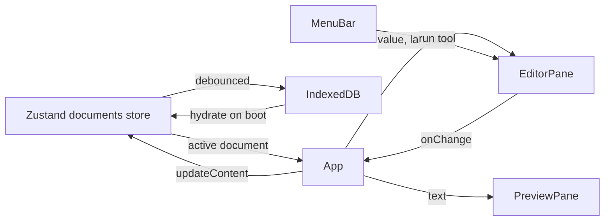

# Architecture

OpenPad is a single-page React app with no backend: everything — editing,
transform tools, Markdown/diagram rendering, persistence — runs in the
browser. This document explains how the pieces fit together and why they're
built the way they are. For the visual design target, see
[`ui-mockup.html`](ui-mockup.html); for what's built vs. planned, see
[`../PROGRESS.md`](../PROGRESS.md).

## Directory map

```
src/
├── App.tsx              Root component: wires the store to the UI,
│                         owns keyboard shortcuts, drag-and-drop, dialogs
├── components/           Presentational React components (one folder each)
│   ├── EditorPane/        CodeMirror wrapper — the editing surface
│   ├── MenuBar/            File/Tools menus, Compare trigger, theme toggle
│   ├── StatusBar/          Cursor position, counts, autosave, notices
│   ├── TabBar/             Tab strip: activate, rename, close
│   └── ShortcutsDialog/    "?" keyboard-shortcut reference
├── editor/               CodeMirror configuration (extensions, theme,
│                         language mapping) — no React here
├── tools/                Pure transform functions + the registry that
│                         drives the Tools menu (the app's core logic)
├── preview/              Markdown → sanitized HTML, Mermaid, PlantUML
├── compare/              Read-only side-by-side diff (@codemirror/merge)
├── files/                Open/Save via File System Access API + fallbacks
├── store/                Zustand documents store (tabs, active doc)
├── storage/              IndexedDB autosave/restore (idb-keyval)
├── theme/                Light/dark theme state
├── pwa/                  Service-worker update UI
└── types/                Shared domain types (NotepadDocument, ToolResult)
```

## Data flow



`App.tsx` is the only place that touches the Zustand store directly for
document mutations; every other component receives data and callbacks as
props. This keeps the store's shape and update logic in one place
(`src/store/documentsStore.ts`) and the components trivially testable in
isolation.

## The tool registry (the core design pattern)

Every transform tool — Base64, JSON format, sort lines, etc. — is a pure
function:

```ts
type ToolResult =
  | { ok: true; output: string; message?: string }
  | { ok: false; error: string; position?: { line: number; column: number } }

run: (input: string) => ToolResult
```

Tools never throw. Malformed input (invalid JSON, bad Base64) is a normal,
expected outcome that comes back as `{ ok: false }` for the status bar to
show — never an exception the UI has to catch.

Each tool is one function (in `src/tools/<category>/`) plus one entry in
[`src/tools/registry.ts`](../src/tools/registry.ts). The Tools menu, the
editor's keyboard shortcuts, and the registry's own invariant tests
(unique ids, unique shortcuts) all derive from that one list — adding a
tool never touches the menu or shortcut-handling code.

`src/tools/apply.ts` is the one place that connects a tool to the live
CodeMirror document: it runs the tool against the selection (or the whole
document if nothing is selected) and applies the result as a single
undoable change.

## Editor (CodeMirror 6)

`src/editor/useCodeMirror.ts` is the React ↔ CodeMirror bridge: CodeMirror
owns its own internal state, React owns `value`/`language` props, and the
hook keeps them in sync without recreating the view on every keystroke
(language switches go through a `Compartment` instead of a remount).

`src/editor/theme.ts` maps the editor's colors and syntax highlighting to
the CSS custom properties in `src/index.css` — the editor never hardcodes
a color, so light/dark theme switching needs no editor reconfiguration.

## Preview pipeline (Markdown / Mermaid / PlantUML)

```
markdown-it → DOMPurify.sanitize → dangerouslySetInnerHTML
```

Every byte of rendered HTML passes through DOMPurify — this is a hard
rule, not a suggestion (see the XSS tests in `markdown.test.ts` and
`PreviewPane.test.tsx`). Fenced code blocks tagged ` ```mermaid ` or
` ```plantuml ` are replaced with placeholder `<div>`s during markdown
rendering; a `useEffect` in `PreviewPane` then upgrades each placeholder:

- **Mermaid** renders locally via a lazy `import('mermaid')` (code-split,
  so plain note-taking never pays its ~1MB cost) and works fully offline.
  `renderMermaid()` queues calls to run one at a time — Mermaid's
  internals aren't safe for concurrent renders (see the M5 note in
  `PROGRESS.md` for the bug this fixes).
- **PlantUML** has no practical in-browser renderer (it needs Java), so
  diagrams render via an `` pointing at a PlantUML server — the
  app's only network-dependent feature. Offline, the source is shown with
  a notice instead of a broken image.

## Persistence

`src/storage/persistence.ts` subscribes to the documents store and writes
the whole workspace (all tabs + which one is active) to IndexedDB,
debounced ~500ms after the last edit. On boot, it's read back before the
UI renders. File handles from the File System Access API (`src/files/`)
are deliberately **not** persisted — a stored handle's permission grant
doesn't reliably survive a reload, so every session starts handle-less
and the first Save behaves like Save As once.

## Offline (PWA)

`vite-plugin-pwa` (configured in `vite.config.ts`) generates a service
worker that precaches every build asset, including all of Mermaid's
lazy-loaded diagram-type chunks — that's what lets diagrams still render
with no network. `registerType: 'prompt'` means updates don't apply
silently; `src/pwa/UpdatePrompt.tsx` shows a dismissible banner instead,
so a user mid-edit doesn't get reloaded out from under themselves.

## Testing strategy

- **Unit/component** (`npm test`, Vitest + React Testing Library):
  `src/tools/**` is held to 100% coverage — it's pure logic with no
  excuse not to be exhaustive. The rest of the app has thresholds a few
  points below its actual measured coverage (`vite.config.ts`).
  `App.tsx` is excluded from the coverage measurement on purpose: it's
  orchestration wiring already exercised by the e2e suite below, and
  unit-testing every callback would just restate what its own
  hooks/components already cover.
- **End-to-end** (`npm run e2e`, Playwright): the golden path against a
  real production build in a real browser — typing, autosave, running a
  tool via menu and via keyboard shortcut, Markdown+Mermaid rendering,
  Compare mode, and a genuine offline reload with the network cut off.
  This is also where CodeMirror's internal keymap dispatch gets verified
  (jsdom can't reliably simulate it).
